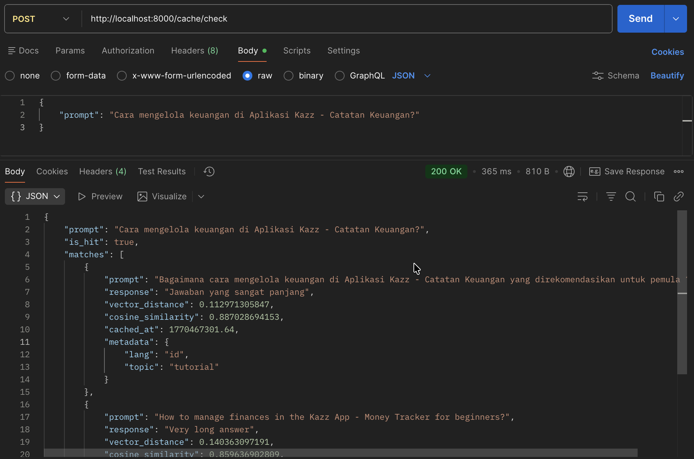
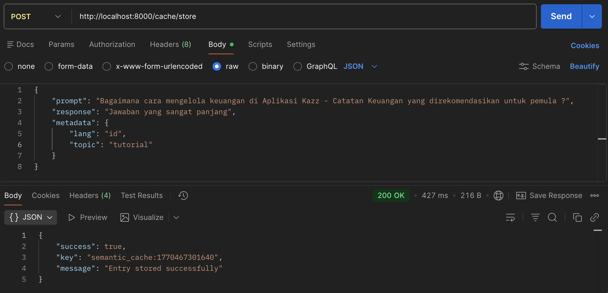

# Semantic Cache Service

A semantic caching service using Redis vector search and EmbeddingGemma. Instead of exact-match caching, it finds semantically similar queries using vector embeddings.

## Why Semantic Caching?

Traditional caching requires identical queries. Semantic caching understands **meaning**:

```
Cache Hit Examples:
"What is machine learning?" ↔ "Explain ML to me"
"Apa itu AI?" ↔ "What is AI?"  (cross-language!)
```

**Benefits:**
- **70%+ reduction** in LLM API costs
- **80%+ faster** responses
- Cross-language matching (Indonesian/English)

## Architecture

```
Client → FastAPI → Redis Vector DB
            ↓
       EmbeddingGemma (768-dim vectors)
```

**Flow:**
1. Client sends prompt to `/cache/check`
2. Generate embedding using EmbeddingGemma
3. Redis performs vector search (HNSW + COSINE)
4. If distance ≤ threshold → cache hit
5. On miss → call LLM, then `/cache/store`

## Tech Stack

- **Python 3.11+** with FastAPI
- **Redis Stack** - Vector database (HNSW index)
- **EmbeddingGemma** - Google's 768-dim multilingual embeddings
- **Ollama** - Local model serving (recommended) OR HuggingFace direct
- **uv** - Fast Python package manager

## Quick Start

### 1. Install Dependencies

```bash
# Install uv if needed
curl -LsSf https://astral.sh/uv/install.sh | sh

# Install project dependencies
uv sync
```

### 2. Setup Embedding Provider

**Option A: Ollama (Recommended - Simple)**

```bash
# Install Ollama
brew install ollama  # macOS
# or visit https://ollama.com

# Pull EmbeddingGemma
ollama pull embeddinggemma
```

**Option B: HuggingFace Direct (Advanced - Requires Auth)**

```bash
# Authenticate with HuggingFace
huggingface-cli login
# Accept license at: https://huggingface.co/google/embeddinggemma-300m
```

📖 **Detailed setup**: See [docs/QUICKSTART.md](docs/QUICKSTART.md)

### 3. Start Redis

```bash
docker compose up -d
```

### 4. Configure Environment

```bash
cp .env.example .env
# Edit .env if needed (defaults work for Ollama)
```

### 5. Run the API

```bash
make dev
# or: uv run uvicorn semantic_cache.api.app:app --reload
```

API available at: `http://localhost:8000`

### 6. Try the Demo

```bash
make demo
```

## API Endpoints

### Check Cache


```bash
curl -X POST http://localhost:8000/cache/check \
  -H "Content-Type: application/json" \
  -d '{"prompt": "What is semantic caching?"}'
```

### Store in Cache


```bash
curl -X POST http://localhost:8000/cache/store \
  -H "Content-Type: application/json" \
  -d '{
    "prompt": "What is semantic caching?",
    "response": "Semantic caching uses vector similarity...",
    "metadata": {}
  }'
```

### Get Statistics
```bash
curl http://localhost:8000/cache/stats
```

### Clear Cache
```bash
curl -X DELETE http://localhost:8000/cache/clear
```

## Project Structure

```
src/semantic_cache/
├── api/
│   ├── app.py                      # FastAPI routes
│   └── dependencies.py             # DI container
├── dto/                            # Request/response models
├── entities/                       # Domain entities
├── protocols/                      # Interface contracts
├── repositories/
│   ├── redis_repository.py         # Redis vector storage
│   ├── ollama_embedding_provider.py
│   └── gemma_embedding_provider.py
├── services/
│   └── cache_service.py            # Business logic
└── handlers/
    └── cache_handler.py            # HTTP layer
```

**Design**: Clean layered architecture with protocol-based dependency injection.

## Configuration

Key environment variables (`.env`):

| Variable | Default | Description |
|----------|---------|-------------|
| `REDIS_URL` | `redis://localhost:6379` | Redis connection URL |
| `CACHE_DISTANCE_THRESHOLD` | `0.15` | Max distance for cache hit (0-2) |
| `CACHE_TTL` | `604800` | Cache TTL in seconds (7 days) |
| `EMBEDDING_MODEL` | `embeddinggemma` | Model name |
| `EMBEDDING_OUTPUT_DIMENSION` | `768` | Output dimension (768/512/256/128) |

## Makefile Commands

```bash
make dev            # Start development server
make test           # Run tests
make lint           # Run linter
make format         # Format code
make cache-clear    # Clear all cache entries
make cache-stats    # Show cache statistics
make demo           # Run demo script
```

## Documentation

- **[Quick Start Guide](docs/QUICKSTART.md)** - Detailed setup for Ollama & HuggingFace
- **[Embedding Models](docs/MODELS.md)** - Model comparison and Matryoshka dimensions
- **[Advanced Topics](docs/ADVANCED.md)** - Production deployment, Redis migration, troubleshooting
- **[CLAUDE.md](CLAUDE.md)** - Instructions for Claude Code assistant

## Key Concepts

### Cosine Distance
- **0.0** = Identical vectors
- **2.0** = Opposite vectors
- Default threshold: **0.15** (~90% similarity)

### HNSW Index
Redis uses Hierarchical Navigable Small World indexing for fast approximate nearest neighbor search.

### Matryoshka Dimensions
EmbeddingGemma supports flexible dimensions (768/512/256/128) via truncation:
- **768**: Maximum quality (default)
- **256**: 66% storage savings, ~10% quality loss
- **128**: 83% storage savings, ~15% quality loss

## Performance Targets

| Metric | Target |
|--------|--------|
| Hit Rate | 60-70% |
| Latency Reduction | 70-80% |
| Cost Savings | 70%+ |
| Cache Lookup | <5ms |

## Development

```bash
make test           # Run pytest
make test-cov       # Run tests with coverage
make lint           # Lint code (ruff)
make format         # Format code (ruff)
make type-check     # Type check (ty)
make check          # Run all checks
```

## License

MIT
